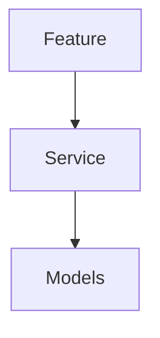

# AIMS — 架构文档（ARCHITECTURE）

> 模块、依赖、契约、目录布局的**唯一权威**。新增/重命名/移动模块或调整依赖方向，必须先改本文，再改代码（同一个 commit）。
> 上游：`PRD.md`（行为）。本文不重复需求，只回答"怎么拆"。

## 0. 阅读指引
<!-- ADS:FILL 一句话说明本文怎么读、各节作用。 -->

## 1. 领域模型（Domain Model）

### 1.1 实体
<!-- ADS:FILL 列出所有名词实体（持久化的）。每个实体：字段、关系、生命周期。 -->
| 实体 | 字段 | 关系 | 持久化？ |
|---|---|---|---|
| {{ENTITY}} | … | … | 是/否 |

### 1.2 派生概念（非持久化）
<!-- ADS:FILL 由实体计算出来、不落库的瞬态概念。 -->

### 1.3 不变量（任何模块都必须维护）
<!-- ADS:FILL 系统级硬约束，编号 I1/I2…，供排查时引用。例：I1 同一 key 同一天至多一条记录。 -->
- I1. …

## 2. 模块清单

> 每个模块一张卡片。**"不负责"是卡片的灵魂** —— 写不出来说明职责没想清，回到 §1 重想。
> 按依赖层级从低到高排列（低层不依赖高层）。

<!-- ADS:FILL 用下面的卡片格式列出每个模块。删除示例，填真实模块。 -->

### Layer 0 — {{LAYER_0_NAME}}（基础设施 / 视觉基座）
```
## 模块名：<Name>
- 职责：一句话
- 不负责：明确写出"不做什么"
- 输入：从哪些模块/外部来
- 输出：暴露给谁
- 关键类型/接口：列签名（不写实现）
- 持有状态：有没有自己的状态？
```

<!-- ADS:FILL 继续按需补 Layer 1..N。常见分层参考（按项目裁剪）：
  L0 基础设施 → L1 数据/模型 → L2 纯计算 → L3 有状态服务 → L4 展示服务 → L5 功能模块/页面 → L6 扩展 → L7 组装根 -->

## 3. 依赖图（DAG）

<!-- ADS:FILL Mermaid 依赖图。箭头 A --> B 表示 A 依赖 B。必须无环。 -->


### 3.1 依赖方向规则
- 高层依赖低层；**反向依赖一律禁止**，需要时用接口/回调倒置。
- 跨模块只走 §3.2 声明的接口契约，不 reach into 内部实现。

### 3.2 跨模块接口契约（写代码时必须遵守的签名）
<!-- ADS:FILL 每个模块对外暴露的关键类型/方法签名。只写签名不写实现。变更签名必须先改这里。 -->
```
// module: <Name>
//   method(args) -> Return   // 保证不变量 Ix
```

## 4. 持久化与边界
<!-- ADS:FILL 数据存哪、谁能写、外部集成（网络/同步/文件）的边界在哪。无持久化可删本节。 -->

## 5. 测试边界
<!-- ADS:FILL 哪些模块必须有单测（纯计算、关键服务），哪些只能真机/集成验证。 -->

## 6. 目录结构（与 §2 模块清单一一对应）
<!-- ADS:FILL 真实目录树。每个目录对应 §2 的哪个模块。 -->
```
src/
└── …
```

## 7. 自检（架构健康度三问）
1. 出 bug 了，能否 30 秒内指出"是哪个模块的责任"？
2. 整体替换模块 X，改动能否控制在 X 内部 + 一个接口适配层？
3. 加新功能，能否立刻说出它属于哪个模块、或要新增哪个模块？

## 8. 待办与已知技术负债
<!-- ADS:FILL 已知的、已登记的负债。未登记的负债 = 红线。 -->

## 9. 文档变更协议
- 加/删模块或改依赖方向 → 改本文 §2 + §3，同一 commit。
- 改对外签名 → 先改 §3.2，再改代码。
- 与 `PRD.md` 冲突 → 以 `PRD.md` 为准，回改本文。
