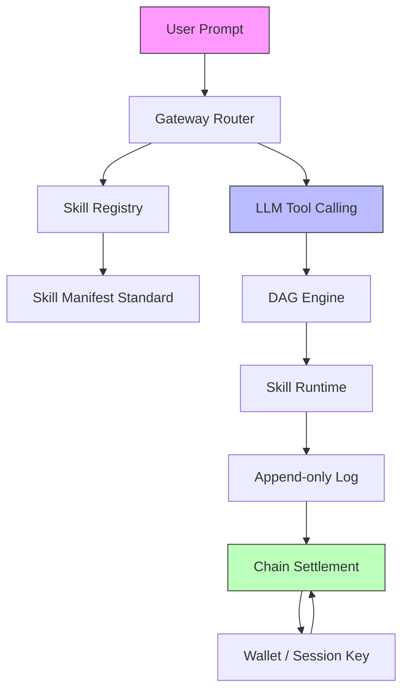

# AIMS — 架构文档（ARCHITECTURE）

> 模块、依赖、契约、目录布局的**唯一权威**。新增/重命名/移动模块或调整依赖方向，必须先改本文，再改代码（同一个 commit）。
> 上游：`PRD.md`（行为）。本文不重复需求，只回答"怎么拆"。

## 0. 阅读指引
从 §1 领域模型了解核心名词 → §2 模块清单看职责拆分 → §3 依赖图理解模块间关系 → §4~§6 看数据流向和目录映射。贯穿全文的红线：**链只做结算和计数，高频跑在本地 Append-only Log。**

## 1. 领域模型（Domain Model）

### 1.1 实体
| 实体 | 字段 | 关系 | 持久化？ |
|------|------|------|----------|
| **Skill** | id, creator_addr, name, version, price_points, counter, manifest_uri, active | Creator 1→N Skills | 链上 + 本地缓存 |
| **SkillManifest** | name, description, input_schema (JSON Schema), output_schema, tags, author, version | Skill 1→1 Manifest | 本地文件 (skill.json) |
| **ExecutionRecord** | id, skill_id, user_addr, timestamp, input_hash, output_hash, duration_ms, status, points_delta | User N→M Skills | 本地 Append-only Log → Batch 上链 |
| **PointAccount** | owner_addr, balance, last_updated | User 1→1 Account | 链上（最终状态） |

### 1.2 派生概念（非持久化）
| 概念 | 来源 | 用途 |
|------|------|------|
| **DAGWorkflow** | LLM 从用户意图拆解出的步骤数组 | 决定 Skill 的执行顺序和依赖 |
| **SessionKey** | 用户授予 AI 的受限自动签名权 | 避免每次调用弹窗确认 |
| **MerkleRoot** | ExecutionRecord 批量计算的哈希根 | Batch 上链的压缩凭证 |
| **PointSnapshot** | 本地计算的最新积分快照 | 用户查询余额不依赖链上查询 |

### 1.3 不变量（任何模块都必须维护）
- I1. 每条 ExecutionRecord 的 `timestamp` + `skill_id` + `user_addr` 三元组全局唯一
- I2. PointAccount 余额不得为负（智能合约级强制）
- I3. 已上链的 ExecutionRecord 不可删除、不可修改（Append-only + 链上最终性）
- I4. SessionKey 必须设置过期时间（过期后 AI 失去自动签名权）
- I5. skill.json 的 `name` 在市场内唯一

## 2. 模块清单

> 按依赖层级从低到高排列。**"不负责"是卡片的灵魂。**

### Layer 0 — 基础设施
```
## 模块名：Ledger (Append-only Log)
- 职责：所有 ExecutionRecord 的本地追加式持久化，提供 Merkle 化 Batch 供链上结算
- 不负责：不解析业务数据，不触发链上交易
- 输入：ExecutionRecord（来自 Runtime / Gateway）
- 输出：MerkleRoot + Batch 数据 → Chain Settlement
- 关键类型/接口：
  - append(record: ExecutionRecord) -> Receipt
  - batch_merkleize(since: Timestamp) -> MerkleRoot
  - query(skill_id, time_range) -> List[ExecutionRecord]
- 持有状态：本地文件系统上的追加日志文件
```

```
## 模块名：Chain Settlement
- 职责：与 Base 智能合约交互，提交 Batch 证据，更新链上积分和计数器
- 不负责：不缓存链上状态（只查询），不触发高频交易
- 输入：MerkleRoot + Batch 数据（来自 Ledger）
- 输出：链上交易回执
- 关键类型/接口：
  - submit_batch(root: MerkleRoot, proof: bytes) -> TxHash
  - query_balance(addr: Address) -> uint256
  - grant_session_key(addr: Address, expiry: uint) -> bytes
- 持有状态：无（每次调用从合约读取）
```

```
## 模块名：Wallet (Session Key Manager)
- 职责：管理 ERC-4337/EIP-7702 嵌入式钱包 + 会话密钥的生命周期
- 不负责：不存储用户主私钥（由系统密钥托管或外部钱包管理）
- 输入：用户授权意图
- 输出：Scope 化的 Session Key → Chain Settlement / Skill 签名
- 关键类型/接口：
  - create_session_key(scopes: List[str], expiry: Timestamp) -> SessionKey
  - revoke_session_key(key_id: str) -> bool
  - sign_with_session(tx_payload: bytes, key: SessionKey) -> Signature
- 持有状态：会话密钥缓存（加密存储）
```

### Layer 1 — 数据层 / 标准定义
```
## 模块名：Skill Manifest Standard
- 职责：定义 skill.json 的 Pydantic 模型，校验所有 Skill 遵守 LLM Tool Calling 格式
- 不负责：不执行 Skill，不管理 Skill 文件
- 输入：原始 skill.json 字典
- 输出：校验通过的 SkillManifest 实例
- 关键类型/接口：
  - class SkillManifest(BaseModel): name, description, input_schema, output_schema, tags, author, version
  - validate(raw: dict) -> SkillManifest
- 持有状态：无（纯校验逻辑）
```

### Layer 2 — 纯计算
```
## 模块名：Skill Registry
- 职责：从本地 skills/manifests/ 目录加载所有 SkillManifest，提供检索和注入能力
- 不负责：不校验业务逻辑，不执行 Skill
- 输入：skills/manifests/*.json 文件（来自本地缓存）
- 输出：List[SkillManifest] → Gateway Router
- 关键类型/接口：
  - load_all() -> List[SkillManifest]
  - get(name: str) -> SkillManifest | None
  - to_tool_definitions() -> List[ToolDefinition]
- 持有状态：内存中的 Manifest 缓存
```

### Layer 3 — 有状态服务
```
## 模块名：Gateway Router
- 职责：万能入口，接收用户自然语言 → 动态注入可用 Skill 到 LLM Tool Calling → 执行 LLM 选择的 Skill → 返回结果
- 不负责：不存储用户对话历史，不做长期会话管理
- 输入：用户 prompt（自然语言文本）
- 输出：执行结果（聚合或单一）
- 关键类型/接口：
  - route(prompt: str) -> RouteResult
  - _inject_tools(manifests: List[SkillManifest]) -> None  // 将 manifests 注入 LLM tools 参数
  - _execute_skill(skill_name: str, args: dict) -> SkillResult
- 持有状态：运行时路由缓存
```

```
## 模块名：DAG Engine
- 职责：当 LLM 返回多个工具调用时，按串行拓扑顺序编排执行
- 不负责：不解析用户意图（由 LLM 完成），不做并行调度（MVP 后）
- 输入：ToolCall[]（来自 LLM 响应）
- 输出：有序的 SkillResult[]
- 关键类型/接口：
  - orchestrate(tool_calls: List[ToolCall]) -> List[SkillResult]
- 持有状态：无
```

### Layer 4 — 执行层
```
## 模块名：Skill Runtime
- 职责：在本地安全环境中执行单个 Skill，记录执行结果到 Ledger
- 不负责：不编排多 Skill，不进行沙箱隔离（MVP 信任模式）
- 输入：Skill 标识符 + 参数（来自 DAG Engine / Router）
- 输出：SkillResult + ExecutionRecord → 返回给调用方并写入 Ledger
- 关键类型/接口：
  - execute(manifest: SkillManifest, args: dict) -> SkillResult
- 持有状态：运行时进程池
```

## 3. 依赖图（DAG）



### 3.1 依赖方向规则
- 高层依赖低层：Gateway → Registry → Manifest
- **反向依赖禁止**（如 Manifest 不依赖 Registry，Ledger 不依赖 Chain）
- 跨模块只走 §3.2 定义的接口契约
- LLM（外部模型）不视为模块，但必须通过统一的 Tool Calling 接口调用

### 3.2 跨模块接口契约（写代码时必须遵守的签名）
```
// module: Skill Manifest Standard
//   validate(raw: dict) -> SkillManifest            // I5: name 唯一性校验

// module: Skill Registry
//   load_all() -> List[SkillManifest]               // 从 skills/manifests/ 加载
//   to_tool_definitions() -> List[dict]              // 转换为 LLM tools 参数格式

// module: Gateway Router
//   route(prompt: str) -> RouteResult               // I4: SessionKey 未过期校验

// module: DAG Engine
//   orchestrate(tool_calls: List[ToolCall]) -> List[SkillResult]  // I1: 三元组唯一

// module: Skill Runtime
//   execute(manifest: SkillManifest, args: dict) -> SkillResult   // 写入 Ledger

// module: Append-only Log
//   append(record: ExecutionRecord) -> Receipt       // I3: 已上链记录不可删除
//   batch_merkleize(since: Timestamp) -> MerkleRoot

// module: Chain Settlement
//   submit_batch(root: MerkleRoot, proof: bytes) -> TxHash  // I2: 余额非负
//   query_balance(addr: Address) -> uint256
```

## 4. 持久化与边界
| 数据 | 存储位置 | 写入者 | 说明 |
|------|----------|--------|------|
| ExecutionRecord | 本地 Append-only Log | Skill Runtime | 高频写入，定期 Batch 上链 |
| SkillManifest | 本地 skills/manifests/ + IPFS | 创作者 | skill.json 文件格式 |
| PointBalance | Base 链上（智能合约状态） | Chain Settlement | 最终状态，本地可缓存查询 |
| SessionKey | 本地加密存储 | Wallet | 设置过期时间，支持撤销 |
| 中间状态/Debug 日志 | 本地临时文件 | 各模块 | 不上链，可清理 |

## 5. 测试边界
| 模块 | 测试策略 |
|------|----------|
| Skill Manifest Standard | 纯 Pydantic 校验，必须全量单测覆盖所有边界 |
| Skill Registry | 加载/检索逻辑单测 + 模拟文件系统 |
| Gateway Router | 集成测试（mock LLM），验证 route() 完整流程 |
| DAG Engine | 串行编排单测 |
| Skill Runtime | 集成测试（沙箱信任模式） |
| Append-only Log | 单测 + 文件 IO 边界测试 |
| Chain Settlement | 本地 Base 测试网 / Foundry fork 集成测试 |
| Wallet (Session Key) | 加密/签名单测 + 过期/撤销场景

## 6. 目录结构（与 §2 模块清单一一对应）
```
src/
├── main.py                          # Layer 7 组装根（仅装配，不实现业务）
├── skills/
│   ├── __init__.py
│   ├── registry.py                  # Layer 2 Skill Registry（加载/检索/转 ToolDef）
│   ├── manifest.py                  # Layer 1 Skill Manifest Standard（Pydantic 模型）
│   └── manifests/                   # 本地缓存的 skill.json 文件
│       └── .gitkeep
├── gateway/
│   ├── __init__.py
│   ├── router.py                    # Layer 3 Gateway Router（万能入口 + 动态工具注入）
│   └── engine.py                    # Layer 3 DAG Engine（串行编排）
├── runtime/
│   ├── __init__.py
│   └── executor.py                  # Layer 4 Skill Runtime（本地执行）
├── ledger/
│   ├── __init__.py
│   ├── log.py                       # Layer 0 Append-only Log
│   └── merkle.py                    # Merkle 化工具
├── chain/
│   ├── __init__.py
│   ├── settlement.py                # Layer 0 Chain Settlement
│   └── wallet.py                    # Layer 0 Wallet (Session Key Manager)
└── contracts/                       # Base 智能合约（Solidity）
    ├── AIMSMarketplace.sol
    ├── AIMSAccount.sol
    └── test/
        └── ...
```

## 7. 自检（架构健康度三问）
1. 出 bug 了，能否 30 秒内指出"是哪个模块的责任"？
2. 整体替换模块 X，改动能否控制在 X 内部 + 一个接口适配层？
3. 加新功能，能否立刻说出它属于哪个模块、或要新增哪个模块？

## 8. 待办与已知技术负债
<!-- ADS:FILL 已知的、已登记的负债。未登记的负债 = 红线。 -->

## 9. 文档变更协议
- 加/删模块或改依赖方向 → 改本文 §2 + §3，同一 commit。
- 改对外签名 → 先改 §3.2，再改代码。
- 与 `PRD.md` 冲突 → 以 `PRD.md` 为准，回改本文。
